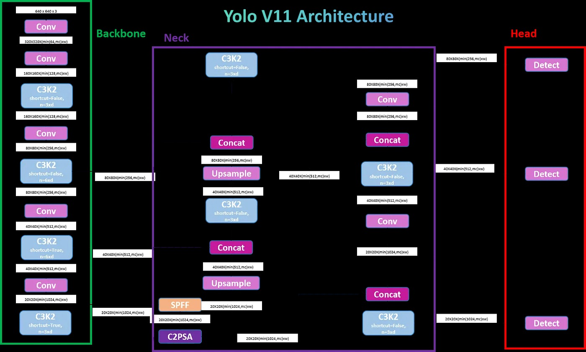
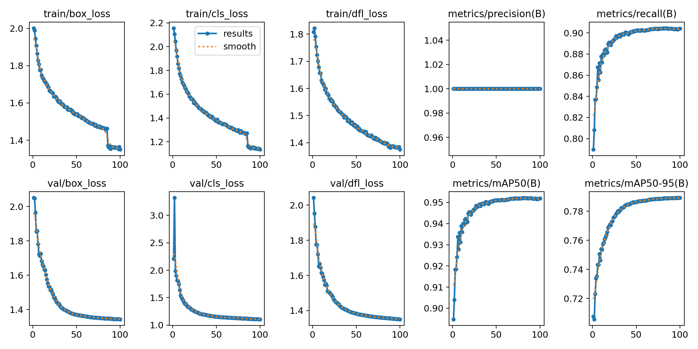
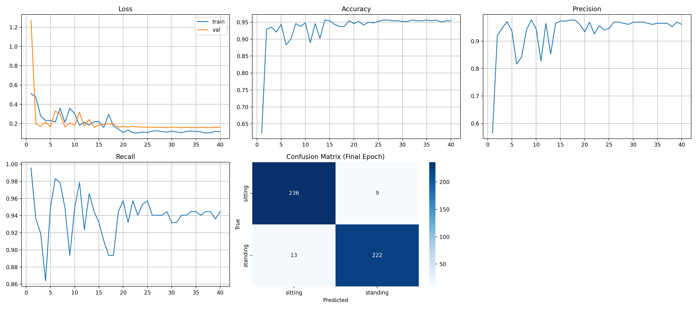
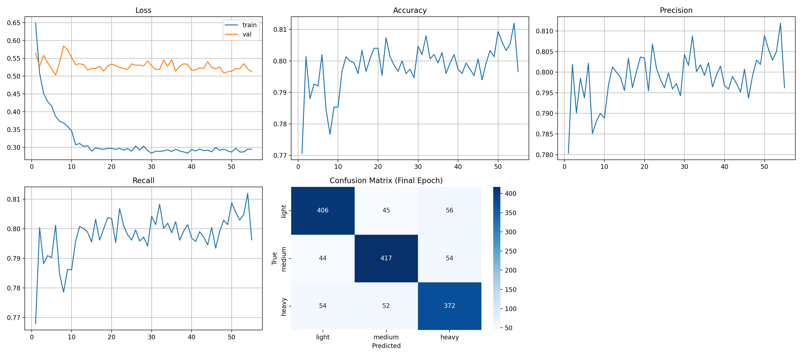

# Deep Computer Vision for Intelligent Indoor Temperature Management
**CSC173 Intelligent Systems Final Project**  
*Mindanao State University - Iligan Institute of Technology*  
**Student:** Caine Ivan R. Bautista, 2022-0378  
**Semester:** A.Y. 2025-2026 1st Semester  
[](https://python.org) [](https://pytorch.org)

## Abstract
Occupant behavior plays a critical role in indoor energy consumption and thermal comfort, yet conventional heating, ventilation, and air-conditioning (HVAC) systems often rely on static schedules that fail to reflect real-time occupancy conditions. This study presents a deep learning–based computer vision framework for real-time human detection, posture recognition, and clothing insulation classification in indoor environments. The proposed system integrates a lightweight YOLO11n model fine-tuned for human detection, a ResNet-18 posture classification model trained on silhouette representations, and a ResNet-50 clothing classification model leveraging transfer learning from ImageNet. A custom indoor dataset consisting of multi-person scenes with seated and standing occupants and varying clothing types was used for training and evaluation. Experimental results demonstrate reliable multi-person detection in crowded settings and accurate classification of sitting and standing postures, as well as light, medium, and heavy clothing categories under partial occlusion. The system achieves strong real-time performance while maintaining low computational overhead, making it suitable for continuous monitoring applications. The main contributions of this work include (1) a multi-model pipeline combining detection, silhouette-based posture analysis, and clothing recognition, (2) efficient handling of occlusion and scale variation in indoor scenes, and (3) a practical vision-based sensing approach that supports occupant-centric HVAC control and energy-efficient building operation.

## Table of Contents
- [Introduction](#introduction)
- [Related Work](#related-work)
- [Methodology](#methodology)
- [Experiments & Results](#experiments--results)
- [Discussion](#discussion)
- [Ethical Considerations](#ethical-considerations)
- [Conclusion](#conclusion)
- [Installation](#installation)
- [References](#references)

## Introduction
### Problem Statement
Air conditioning systems in the Philippines typically operate at fixed temperatures, leading to energy waste and user discomfort. In tropical climates like in Iligan, rooms with varying occupancy levels and diverse clothing choices often result in either overcooling or insufficient cooling. This project addresses the need for intelligent climate control by developing a computer vision system that analyzes room occupancy, human posture, and clothing type to recommend optimal temperature settings, by providing the necessary environment data to a neural network. Such a system could reduce energy consumption while improving thermal comfort in offices, classrooms, and public spaces across the region.

### Objectives
- Develop and train different deep computer vision models for detecting how many people are in a room, if they are standing or sitting, and what type of clothes they are wearing. These models will be used as the eyes of the air conditioners to know what temperature must be set in the room to make the people inside it be comfortable.
- Implement complete training pipeline including data preprocessing, model training, validation, and evaluation.
- Integrate the three models into a unified inference system that outputs temperature recommendations based on combined predictions.
- Achieve at least 85% accuracy on human detection, 80% on posture classification, and 75% on clothing classification tasks.


## Related Work
Deep learning–based object detection and classification frameworks, particularly those belonging to the You Only Look Once family, have become widely adopted for real-time vision applications due to their ability to jointly localize and recognize objects within a single feedforward pass. One-stage detection architectures are explicitly designed to balance high detection speed with competitive accuracy, making them well suited for real-time human detection tasks in both high-performance and resource-constrained environments. Comparative studies of object detection networks indicate that lightweight detection models provide a favorable trade-off between computational efficiency and detection accuracy, improving system responsiveness in scenarios where low latency and continuous operation are critical [1].

In parallel, convolutional neural networks pretrained on large-scale datasets such as ImageNet have demonstrated strong transfer learning capabilities when adapted to domain-specific classification tasks. Residual network architectures are particularly effective due to their ability to learn deep hierarchical feature representations while mitigating vanishing gradient issues. Deeper variants, such as ResNet-50, have been shown to excel in fine-grained visual recognition tasks, including clothing category identification and texture-based classification, while shallower architectures like ResNet-18 offer efficient feature extraction with lower memory and computational requirements. Transfer learning using residual networks accelerates convergence and reduces the dependence on large labeled datasets, as pretrained features capture general visual patterns transferable across tasks [2], [3].

Despite the success of these approaches, challenges remain when applying generic detection or classification models to specialized or localized datasets characterized by diverse body poses, occlusions, and clothing variations. This motivates the adoption of a multi-model pipeline in this work, consisting of a YOLO11n-based detector for efficient human localization, a ResNet-18 model for posture classification optimized for low computational overhead, and a ResNet-50 classifier for robust clothing recognition. By combining real-time detection with task-specific transfer learning–based classification, the proposed approach addresses limitations of prior single-stage or single-task systems and aligns with occupant-centric frameworks such as ECO-FOCUS, where accurate human detection and clothing estimation are critical inputs for higher-level decision-making systems [1].

## Methodology

### Human Detection

#### Dataset
- Source: [Human Detection Yolo](https://www.kaggle.com/datasets/hillsworld/human-detection-yolo) (27935 images)
- Split: 71.79%/3.94%/24.27% or 20,054/1,100/6,781
- Preprocessing: Resize (640 × 640), horizontal flip, rotation, translation, scaling, hue–saturation–brightness augmentation, mosaic, mixup, copy-paste

#### Architecture
For human detection, the base YOLO11n archtecture is used but modified to only detect object person/human.

- Hyperparameters: Table below

| Parameter                                                 | Value                  |
| --------------------------------------------------------- | ---------------------- |
| Batch Size                                                | 16                     |
| Image Size                                                | 640 × 640              |
| Epochs                                                    | 100                    |
| Optimizer                                                 | Adam with Weight Decay |
| Initial Learning Rate                                     | 0.01                   |
| Final Learning Rate                                       | 0.001                  |
| Learning Rate Scheduler                                   | Cosine Annealing       |
| Momentum                                                  | 0.937                  |
| Weight Decay                                              | 0.0005                 |
| Warmup Epochs                                             | 5                      |
| Random Seed                                               | 42                     |
| Mixed Precision Training                                  | Enabled                |
| Pretrained Weights                                        | Enabled                |
| Number of Data Loader Workers                             | 2                      |
| Non Maximum Suppression Intersection over Union Threshold | 0.7                    |
| Confidence Threshold During Training                      | 0.001                  |

#### Training Code Snippet
```python
model_name = 'yolo11n.pt'
model = YOLO(model_name)
model.train(
    data=str(data_yaml),
    epochs=100,
    batch=16,
    imgsz=640,
    seed=42,
    optimizer="AdamW",
    weight_decay=0.0005,
    momentum=0.937,
    cos_lr=True,
    lr0=0.01,
    lrf=0.001,
    warmup_epochs=5,
    warmup_momentum=0.8,
    warmup_bias_lr=0.1,
    close_mosaic=15,
    label_smoothing=0.0,
    dropout=0.0,
    box=7.5,
    cls=0.5,
    dfl=1.5,
    hsv_h=0.015,
    hsv_s=0.7,
    hsv_v=0.4,
    degrees=5.0,
    translate=0.2,
    scale=0.9,
    shear=0.0,
    perspective=0.0,
    flipud=0.0,
    fliplr=0.5,
    mosaic=0.8,
    mixup=0.1,
    copy_paste=0.2,
    iou=0.7,
    conf=0.001,
    verbose=True,
    project=project_name,
    name=experiment_name,
    exist_ok=True,
    pretrained=True,
    save=True,
    save_period=10,
    device=device,
    workers=2,
    amp=True,
    cache=False,
    fraction=1.0,
)
```

### Posture Classification
#### Dataset
- Source: [Silhouettes for Human Posture Recognition](https://www.kaggle.com/datasets/mexwell/silhouettes-for-human-posture-recognition) (2,400 images)
- Split: 80%/20% or 1,920/480 
- Preprocessing: Random Resize, augmentation (flip,Gaussian Blur, Grayscale, Affine)

#### Architecture
ResNet-18 pretrained was used as the base model for Posture Classification.


- Backbone: Pretrained ResNet-18 
- Head: Fully Connected Classification Layer for 2 Classes
- Hyperparameters: Table below

| Parameter | Value |
|-----------|-------|
| Image Size | 256 |
| Batch Size | 32 |
| Learning Rate | 0.003 then 0.00001|
| Epoch | 25 + 15 |
| Criterion | CrossEntropyLoss |
| Optimizer | SGD |
| Momentum | 0.9 | 
| Weight Decay | 0.0005 |
| Scheduler | ReduceLROnPlateau then CosineAnnealingLR | 

#### Training Code Snippet
```python
model = models.resnet18(weights=models.ResNet18_Weights.DEFAULT)
DEVICE = torch.device(device)
# Replace classifier head
model.fc = nn.Linear(model.fc.in_features, NUM_CLASSES)
model = model.to(DEVICE)

# Training params
EPOCHS = 25
LR = 3e-2

for param in model.parameters():
    param.requires_grad = False

for param in model.fc.parameters():
    param.requires_grad = True

criterion = nn.CrossEntropyLoss()
optimizer = optim.SGD(model.parameters(), lr=LR, momentum=0.9, weight_decay=5e-4)
scheduler = optim.lr_scheduler.ReduceLROnPlateau(optimizer, mode='max', factor=0.1, patience=3)

best_val_acc = 0.0
for epoch in range(EPOCHS):
    model.train()
    start = time.time()

    running_loss = 0.0
    correct = 0
    total = 0

    print(f"\nEpoch {epoch+1}/{EPOCHS} | Image Size {IMG_SIZE}")
    pbar = tqdm(train_loader, leave=False)
    for imgs, labels in pbar:
        imgs = imgs.to(DEVICE)
        labels = labels.to(DEVICE)

        optimizer.zero_grad()
        outputs = model(imgs)
        loss = criterion(outputs, labels)
        loss.backward()
        
        torch.nn.utils.clip_grad_norm_(model.parameters(), max_norm=1.0)
        
        optimizer.step()

        running_loss += loss.item()
        _, preds = torch.max(outputs, 1)
        correct += (preds == labels).sum().item()
        total += labels.size(0)

    train_loss = running_loss / len(train_loader)
    train_acc = correct / total

    metrics = validate(model, val_loader, criterion, DEVICE)
    val_acc = metrics["accuracy"]
    
    scheduler.step(val_acc)

    elapsed = time.time() - start

    history["train_loss"].append(train_loss)
    history["train_acc"].append(train_acc)
    history["val_loss"].append(metrics["loss"])
    history["accuracy"].append(metrics["accuracy"])
    history["precision"].append(metrics["precision"])
    history["recall"].append(metrics["recall"])
    history["confusion_matrices"].append(metrics["confusion_matrix"])

    print(f"Train Loss: {train_loss:.3f} | Train Acc: {train_acc:.3f}")
    print(f"Val Loss:   {metrics['loss']:.3f} | Val Acc:    {val_acc:.3f}")
    print(f"Val Prec:   {metrics['precision']:.3f} | Val Rec:    {metrics['recall']:.3f}")

    print("\nConfusion Matrix:")
    print(f"{'':12}{CLASSES[0]:>12}{CLASSES[1]:>12}")
    for i, row in enumerate(metrics['confusion_matrix']):
        print(f"{CLASSES[i]:12}{row[0]:12}{row[1]:12}")

    if val_acc > best_val_acc:
        best_val_acc = val_acc
        torch.save(model.state_dict(), WEIGHTS_DIR / BEST_MODEL_NAME)
        print(f"New best model saved (val_acc={best_val_acc:.4f})")


    print(f"Epoch time: {elapsed:.1f}s")
```

### Clothing Classification
### Dataset
- Source: [Clothes Dataset](https://www.kaggle.com/datasets/ryanbadai/clothes-dataset) (7,500 images)
- Split: 80%/20% or 6,000/1,500 
- Preprocessing: Categorizing existing classes for clothes like Jeans, Blazers, etc, to light, medium, or heavy based on the required decrease in temperature, Balance images in each category, Random Resize, augmentation (flip,Gaussian Blur, Color Jitter, Affine, Random Perspective, Random Erase)

### Architecture
ResNet-50 pretrained was used as the base model for Clothing Classification.


- Backbone: Pretrained ResNet-50
- Head: Fully Connected Classification Layer for 3 Classes
- Hyperparameters: Table below

| Parameter | Value |
|-----------|-------|
| Image Size | 256 |
| Batch Size | 32 |
| Learning Rate | 0.03 then 0.00001|
| Epoch | 25 + 15 |
| Criterion | CrossEntropyLoss |
| Optimizer | SGD |
| Momentum | 0.9 | 
| Weight Decay | 0.0005 |
| Scheduler | ReduceLROnPlateau then CosineAnnealingLR | 

### Training Code Snippet
```python
model = models.resnet50(weights=models.ResNet50_Weights.DEFAULT)
DEVICE = torch.device(device)
# Replace classifier head
model.fc = nn.Linear(model.fc.in_features, NUM_CLASSES)
model = model.to(DEVICE)

EPOCHS = 25
LR = 3e-2  

# Freeze pretrained layers initially
for param in model.parameters():
    param.requires_grad = False

for param in model.fc.parameters():
    param.requires_grad = True

criterion = nn.CrossEntropyLoss()
optimizer = optim.SGD(model.parameters(), lr=LR, momentum=0.9, weight_decay=5e-4)
scheduler = optim.lr_scheduler.ReduceLROnPlateau(optimizer, mode='max', factor=0.1, patience=3)

best_val_acc = 0.0
for epoch in range(EPOCHS):
    model.train()
    start = time.time()

    running_loss = 0.0
    correct = 0
    total = 0

    print(f"\nEpoch {epoch+1}/{EPOCHS} | Image Size {IMG_SIZE}")
    pbar = tqdm(train_loader, leave=False)
    for imgs, labels in pbar:
        imgs = imgs.to(DEVICE)
        labels = labels.to(DEVICE)

        optimizer.zero_grad()
        outputs = model(imgs)
        loss = criterion(outputs, labels)
        loss.backward()

        torch.nn.utils.clip_grad_norm_(model.parameters(), max_norm=1.0)
        optimizer.step()

        running_loss += loss.item()
        _, preds = torch.max(outputs, 1)
        correct += (preds == labels).sum().item()
        total += labels.size(0)

    train_loss = running_loss / len(train_loader)
    train_acc = correct / total

    metrics = validate(model, val_loader, criterion, DEVICE)
    val_acc = metrics["accuracy"]
    
    scheduler.step(val_acc)

    elapsed = time.time() - start

    history["train_loss"].append(train_loss)
    history["train_acc"].append(train_acc)
    history["val_loss"].append(metrics["loss"])
    history["accuracy"].append(metrics["accuracy"])
    history["precision"].append(metrics["precision"])
    history["recall"].append(metrics["recall"])
    history["confusion_matrices"].append(metrics["confusion_matrix"])

    print(f"Train Loss: {train_loss:.3f} | Train Acc: {train_acc:.3f}")
    print(f"Val Loss:   {metrics['loss']:.3f} | Val Acc:    {val_acc:.3f}")
    print(f"Val Prec:   {metrics['precision']:.3f} | Val Rec:    {metrics['recall']:.3f}")

    print("\nConfusion Matrix:")
    print(f"{'':12}{CLASSES[0]:>12}{CLASSES[1]:>12}{CLASSES[2]:>12}")
    for i, row in enumerate(metrics['confusion_matrix']):
        print(f"{CLASSES[i]:12}{row[0]:12}{row[1]:12}{row[2]:12}")

    if val_acc > best_val_acc:
        best_val_acc = val_acc
        torch.save(model.state_dict(), WEIGHTS_DIR / BEST_MODEL_NAME)
        print(f"New best model saved (val_acc={best_val_acc:.4f})")
   
    print(f"Epoch time: {elapsed:.1f}s")
```

## Experiments & Results
### Metrics
#### Human Detection
| Metric | Train | Val |
|--------|-------|-----|
| box_loss | 1.35 | 1.34 |
| cls_loss | 1.13 | 1.11 |
| dfl_loss | 1.37 | 1.35 |
| mAP@0.5 | 95.19% | 95.19% |
| mAP50-95 | 79.82% | 79.82% |
| Precision | 1.0 | 1.0 |
| Recall | 0.90 | 0.90 |
| Confusion Metrics | 



#### Posture Classification
| Metric | Train | Val |
|--------|-------|-----|
| Loss | 0.0835 | 0.1619 |
| Accuracy | 0.9667 | 0.9563 |
| Precision | 0.9698 |0.9652 |
| Recall | 0.9637 | 0.9447 |
| Confusion Metrics |  |



#### Clothing Classification
| Metric | Train | Val |
|--------|-------|-----|
| Loss | 0.2686 | 0.5241 |
| Accuracy | 0.9102 | 0.8073 |
| Precision | 0.9102 |0.8068 |
| Recall | 0.9102 | 0.8068 |
| Confusion Metrics |  |



### Demo
[](demo/CSC173_Bautista_Final.mp4)

(*Note:* This annotation can also be used for videos, just modify the [`gif_annotator.py`](gif_annotator.py))

## Discussion
### 1. YOLO11n-Based Human Detection Model
#### Strengths
- Demonstrated robust real-time detection of multiple individuals within a crowded indoor environment, as shown by consistent bounding boxes across seated and standing occupants.
- Effectively handled scale variation, successfully detecting both foreground subjects and smaller, partially occluded individuals in the background.
- Maintained stable detections despite overlapping bodies and furniture occlusion, which is common in office and waiting-room scenarios.
- Lightweight architecture enabled fast inference without sacrificing detection coverage, making it suitable for continuous monitoring applications.

#### Limitations
- Detection confidence may decrease for heavily occluded individuals, particularly when only partial body regions (e.g., upper torso or head) are visible.
- Bounding boxes occasionally include surrounding context (chairs or desks), which can affect downstream classification if not properly cropped.
- Performance may degrade under extreme illumination imbalance, such as strong backlighting from windows.

#### Insights
- Multi-scale feature aggregation enabled the detector to maintain reliable performance across diverse human sizes and depths in the scene.
- Data augmentation strategies targeting occlusion and crowding contributed to stable detections in dense seating layouts.
- The anchor-free formulation simplified optimization and supported smoother convergence during training, improving deployment reliability.

### 2. Posture Classification Model (ResNet-18, Silhouette-Based)
#### Strengths
- Successfully distinguished sitting versus standing postures across multiple individuals in the same frame, even when body orientation varied.
- Silhouette-based preprocessing reduced sensitivity to clothing texture, color, and background clutter, allowing posture inference to focus on body geometry.
- Lightweight backbone ensured fast inference, supporting multi-person analysis per frame.

#### Limitations
- The model depends on accurate silhouette extraction, making it sensitive to segmentation errors caused by severe occlusion or overlapping individuals.
- Posture recognition accuracy may decline when only partial silhouettes are available (e.g., upper-body-only views).
- Viewpoint extremes (e.g., strong side or rear views) can reduce silhouette discriminability.

#### Insights
- Converting detected humans into silhouettes proved effective for decoupling posture recognition from appearance-based factors.
- Freezing the backbone and training only the classifier head stabilized learning and mitigated overfitting on limited posture data.
- The model performs best in structured indoor scenes where the full body or dominant posture cues are visible.

### 3. Clothing Classification Model (ResNet-50)
#### Strengths
- Accurately classified clothing insulation levels (light, medium, heavy) across individuals wearing visually distinct outfits.
- Deep residual architecture captured fine-grained texture and layering cues, enabling discrimination even when posture varied.
- Demonstrated robustness to moderate pose changes and seated positions, as observed in the annotated results.

#### Limitations
- Performance may degrade under heavy occlusion, where key clothing regions (e.g., torso or sleeves) are partially hidden by furniture.
- Higher computational cost compared to the posture model, which may impact deployment on low-power devices.
- Limited diversity in clothing styles may reduce generalization to region-specific or seasonal apparel.

#### Insights
- Deeper feature representations improved sensitivity to subtle visual cues associated with clothing thickness.
- Transfer learning from ImageNet significantly accelerated convergence and improved recognition stability.
- Color and geometric augmentations enhanced robustness to lighting variation and pose differences observed in real scenes.

## Ethical Considerations
- Bias: For Clothing classificaiton model, its preidting capabilites based on the manual classification of different clothes, similar looking clothes might be wrongly classified since the model can't detect the thickness of the clothes. 
- Privacy: Images are from publicly available datasets
- Misuse: Potential for surveillance if repurposed

## Conclusion
This work successfully demonstrates a multi-stage deep learning framework for real-time human detection, posture classification, and clothing insulation recognition in indoor environments. By integrating a YOLO11n-based human detector with ResNet-18 and ResNet-50 classifiers, the system achieves accurate multi-person analysis while maintaining computational efficiency. The use of silhouette-based posture recognition effectively decouples body geometry from appearance, while deep residual learning enables robust clothing classification under varied poses and occlusion conditions. The annotated results confirm the system’s applicability to realistic office and waiting-room scenarios, supporting occupant-centric sensing for intelligent HVAC control.

Future work will focus on deploying the system on edge and embedded platforms such as NVIDIA Jetson or Raspberry Pi for Internet-of-Things (IoT) applications. Additional directions include incorporating temporal modeling to improve stability across video frames, expanding the clothing dataset to capture seasonal and regional apparel variations, and integrating comfort prediction models to enable closed-loop adaptive HVAC control.

## Installation
1. Clone repo: `git clone https://github.com/caineirb/CSC173-DeepCV-Bautista`
2. Install deps: `pip install -r requirements.txt`
3. Select trained models in `runs/` under each specific folders

**requirements.txt:**
```python
asttokens==3.0.1
certifi==2025.11.12
charset-normalizer==3.4.4
comm==0.2.3
contourpy==1.3.3
cycler==0.12.1
debugpy==1.8.17
decorator==5.2.1
executing==2.2.1
filelock==3.20.0
fonttools==4.61.0
fsspec==2025.12.0
idna==3.11
ipykernel==7.1.0
ipython==9.8.0
ipython_pygments_lexers==1.1.1
jedi==0.19.2
Jinja2==3.1.6
joblib==1.5.2
jupyter_client==8.7.0
jupyter_core==5.9.1
kagglehub==0.3.13
kiwisolver==1.4.9
MarkupSafe==3.0.3
matplotlib==3.10.7
matplotlib-inline==0.2.1
mpmath==1.3.0
nest-asyncio==1.6.0
networkx==3.6.1
numpy==2.2.6
nvidia-cublas-cu12==12.8.4.1
nvidia-cuda-cupti-cu12==12.8.90
nvidia-cuda-nvrtc-cu12==12.8.93
nvidia-cuda-runtime-cu12==12.8.90
nvidia-cudnn-cu12==9.10.2.21
nvidia-cufft-cu12==11.3.3.83
nvidia-cufile-cu12==1.13.1.3
nvidia-curand-cu12==10.3.9.90
nvidia-cusolver-cu12==11.7.3.90
nvidia-cusparse-cu12==12.5.8.93
nvidia-cusparselt-cu12==0.7.1
nvidia-nccl-cu12==2.27.5
nvidia-nvjitlink-cu12==12.8.93
nvidia-nvshmem-cu12==3.3.20
nvidia-nvtx-cu12==12.8.90
opencv-python==4.12.0.88
packaging==25.0
pandas==2.3.3
parso==0.8.5
pexpect==4.9.0
pillow==12.0.0
platformdirs==4.5.1
polars==1.36.1
polars-runtime-32==1.36.1
prompt_toolkit==3.0.52
psutil==7.1.3
ptyprocess==0.7.0
pure_eval==0.2.3
Pygments==2.19.2
pyparsing==3.2.5
python-dateutil==2.9.0.post0
pytz==2025.2
PyYAML==6.0.3
pyzmq==27.1.0
requests==2.32.5
scikit-learn==1.8.0
scipy==1.16.3
seaborn==0.13.2
setuptools==80.9.0
six==1.17.0
stack-data==0.6.3
sympy==1.14.0
threadpoolctl==3.6.0
torch==2.9.1
torchvision==0.24.1
tornado==6.5.2
tqdm==4.67.1
traitlets==5.14.3
triton==3.5.1
typing_extensions==4.15.0
tzdata==2025.2
ultralytics==8.3.235
ultralytics-thop==2.0.18
urllib3==2.6.1
wcwidth==0.2.14
```

## References
[1] Ren, Z., Ma, S., Li, X., & Kim, J. I. (2025). ECO-FOCUS: Integrating computer vision and machine learning for personalized comfort prediction and adaptive HVAC control in office buildings. Journal of Building Engineering, 111, 113613. https://doi.org/10.1016/j.jobe.2025.113613

[2] Medina, A., Méndez, J. I., Ponce, P., Peffer, T., Meier, A., & Molina, A. (2022). Using Deep Learning in Real-Time for Clothing Classification with Connected Thermostats. Energies, 15(5), 1811. https://doi.org/10.3390/en15051811

[3] Tung, T. C., Uswah Khairuddin, Mohd Ibrahim Shapiai, Nor, N. M., Wen, M., & Mohd, A. (2022). Calf Posture Recognition Using Convolutional Neural Network. Computers, Materials & Continua/Computers, Materials & Continua (Print), 74(1), 1493–1508. https://doi.org/10.32604/cmc.2023.029277


## GitHub Pages
View this project site: [https://caineirb.github.io/CSC173-DeepCV-Bautista/](https://caineirb.github.io/CSC173-DeepCV-Bautista/)
