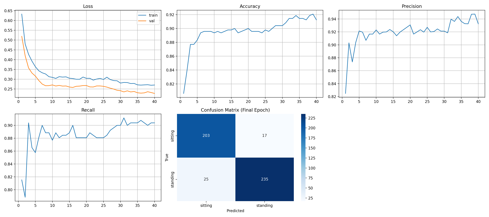
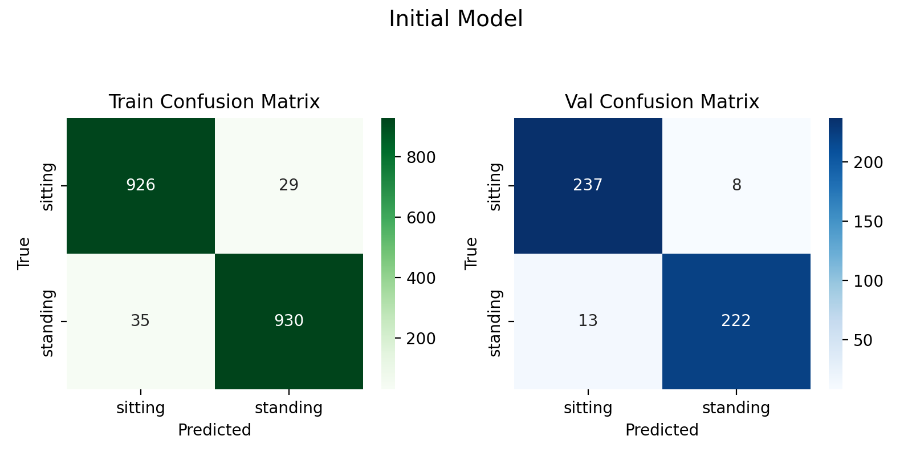

# CSC173 Deep Computer Vision Project Progress Report
**Student:** Caine Ivan R. Bautista, 2022-0378
**Date:** December 19, 2025
**Repository:** [CSC173-DeepCV-Bautista](https://github.com/caineirb/CSC173-DeepCV-Bautista)  
**Commits Since Proposal:** 5 commits | **Last Commit:** December 16, 2025

## 📊 Current Status
|      **Milestone**      |       **Human Detection**       |        **Posture Classification**       |       **Clothing Classification**       |
| :---------------------: | :---------------------------------------: | :-------------------------------------: | :-------------------------------------: |
| **Dataset Preparation** |✅ Completed|✅ Completed|✅ Completed|
|   **Initial Training**  |✅ Completed|✅ Completed|✅ Completed|
| **Baseline Evaluation** |✅ Completed|✅ Completed|⏳ Not Started Next Phase|
|  **Model Fine-tuning**  |✅ Completed|✅ Completed|⏳ Not Started Scheduled after initial models training |

## 1. Dataset Progress
### Human Detection
- **Total images:** 
    - 27,935
- **Train/Val/Test split:**
    - 71.79%/3.94%/24.27% or 20,054/1,100/6,781
- **Classes implemented:**
    - ["Person"]
- **Preprocessing applied:** Resize(640x640), augmentation (flip, rotate, brightness)
- **Sample data preview:**

### Posture Classification
- **Total images:** 
    - 2,400
- **Train/Val split:**
    - 80%/20% or 1,920/480 
- **Classes implemented:**
    - ["sitting", "standing"]
- **Preprocessing applied:** Random Resize, augmentation (flip,Gaussian Blur, Grayscale, Affine)
- **Sample data preview:**

## 2. Training Progress
**Training Curves (so far)**
### Human Detection

### Posture Classification

**Current Metrics:**
### Human Detection
| Metric | Train | Val |
|--------|-------|-----|
| box_loss | 1.35 | 1.34 |
| cls_loss | 1.13 | 1.11 |
| dfl_loss | 1.37 | 1.35 |
| mAP@0.5 | 95.19% | 95.19% |
| mAP50-95 | 79.82% | 79.82% |
| Precision | 1.0 | 1.0 |
| Recall | 0.90 | 0.90 |
### Posture Classification
| Metric | Train | Val |
|--------|-------|-----|
| Loss | 0.2905 | 0.2580 |
| Accuracy | 0.8786 | 0.9000 |
| Precision | 0.8574 |0.9141 |
| Recall | 0.9021 | 0.9000 |
| Confusion Metrics: |  |

## 3. Challenges Encountered & Solutions
| Issue | Status | Resolution |
|-------|--------|------------|
| CUDA out of memory | ✅ Fixed | Reduced batch_size from 32→16 and workers set to 2 |

## 4. Next Steps (Before Final Submission)
- [] Retrail Clothing Classification Model
- [ ] Record 5-min demo video
- [ ] Write complete README.md with results