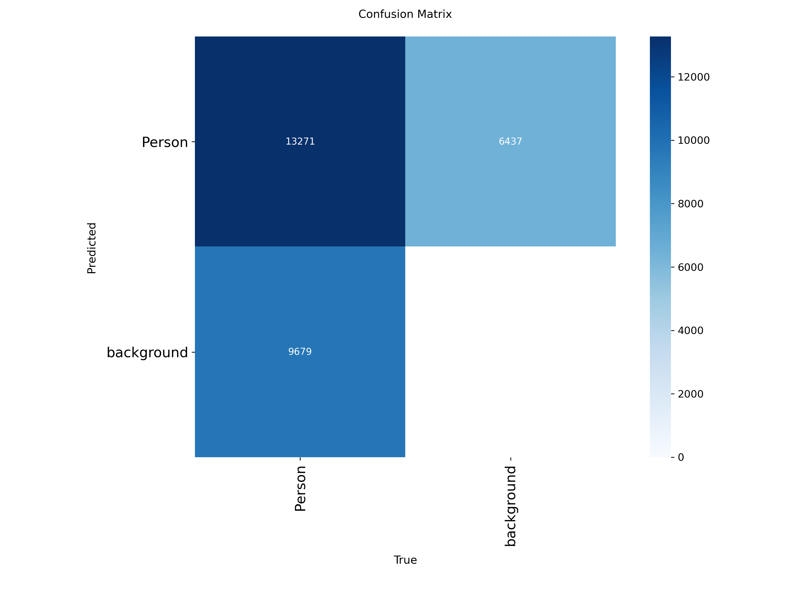
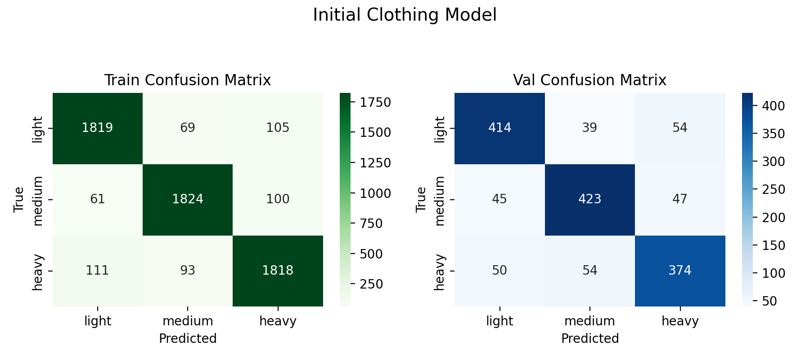

# CSC173 Deep Computer Vision Project Progress Report
**Student:** Caine Ivan R. Bautista, 2022-0378
**Date:** December 20, 2025
**Repository:** [CSC173-DeepCV-Bautista](https://github.com/caineirb/CSC173-DeepCV-Bautista)  
**Commits Since Proposal:** 6 commits | **Last Commit:** December 19, 2025

## 📊 Current Status
|      **Milestone**      |       **Human Detection**       |        **Posture Classification**       |       **Clothing Classification**       |
| :---------------------: | :---------------------------------------: | :-------------------------------------: | :-------------------------------------: |
| **Dataset Preparation** |✅ Completed|✅ Completed|✅ Completed|
|   **Initial Training**  |✅ Completed|✅ Completed|✅ Completed|
| **Baseline Evaluation** |✅ Completed|✅ Completed|✅ Completed|
|  **Model Fine-tuning**  |✅ Completed|✅ Completed|✅ Completed|

## 1. Dataset Progress
### Human Detection
- **Total images:** 
    - 27,935
- **Train/Val/Test split:**
    - 71.79%/3.94%/24.27% or 20,054/1,100/6,781
- **Classes implemented:**
    - ["Person"]
- **Preprocessing applied:** Resize (640 × 640), horizontal flip, rotation, translation, scaling, hue–saturation–brightness augmentation, mosaic, mixup, copy-paste
- **Sample data preview:**
#### Human Dataset Sample

### Posture Classification
- **Total images:** 
    - 2,400
- **Train/Val split:**
    - 80%/20% or 1,920/480 
- **Classes implemented:**
    - ["sitting", "standing"]
- **Preprocessing applied:** Random Resize, augmentation (flip,Gaussian Blur, Grayscale, Affine)
- **Sample data preview:**
#### Sitting

#### Standing

### Clothing Classification
- **Total images:** 
    - 7,500
- **Train/Val split:**
    - 80%/20% or 6,000/1,500 
- **Classes implemented:**
    - ["light", "medium", "heavy"]
- **Preprocessing applied:** Categorizing existing classes for clothes like Jeans, Blazers, etc, to light, medium, or heavy based on the required decrease in temperature, Balance images in each category, Random Resize, augmentation (flip,Gaussian Blur, Color Jitter, Affine, Random Perspective, Random Erase)
- **Sample data preview:**
#### Light Wear

#### Medium Wear

#### Heavy Wear

## 2. Training Progress
**Training Curves (so far)**
### Human Detection

### Posture Classification

### Clothing Classification

**Current Metrics:**
### Human Detection
| Metric | Train | Val |
|--------|-------|-----|
| box_loss | 1.35 | 1.34 |
| cls_loss | 1.13 | 1.11 |
| dfl_loss | 1.37 | 1.35 |
| mAP@0.5 | 95.19% | 95.19% |
| mAP50-95 | 79.82% | 79.82% |
| Precision | 1.0 | 1.0 |
| Recall | 0.90 | 0.90 |
| Confusion Metrics | 
### Posture Classification
| Metric | Train | Val |
|--------|-------|-----|
| Loss | 0.0835 | 0.1619 |
| Accuracy | 0.9667 | 0.9563 |
| Precision | 0.9698 |0.9652 |
| Recall | 0.9637 | 0.9447 |
| Confusion Metrics |  |
### Clothing Classification
| Metric | Train | Val |
|--------|-------|-----|
| Loss | 0.2686 | 0.5241 |
| Accuracy | 0.9102 | 0.8073 |
| Precision | 0.9102 |0.8068 |
| Recall | 0.9102 | 0.8068 |
| Confusion Metrics |  |

## 3. Challenges Encountered & Solutions
| Issue | Status | Resolution |
|-------|--------|------------|
| CUDA out of memory | ✅ Fixed | Reduced batch_size from 32→16 and workers set to 2 |

## 4. Next Steps (Before Final Submission)
- [X] Retrain Clothing Classification Model
- [ ] Record 5-min demo video
- [ ] Write complete README.md with results